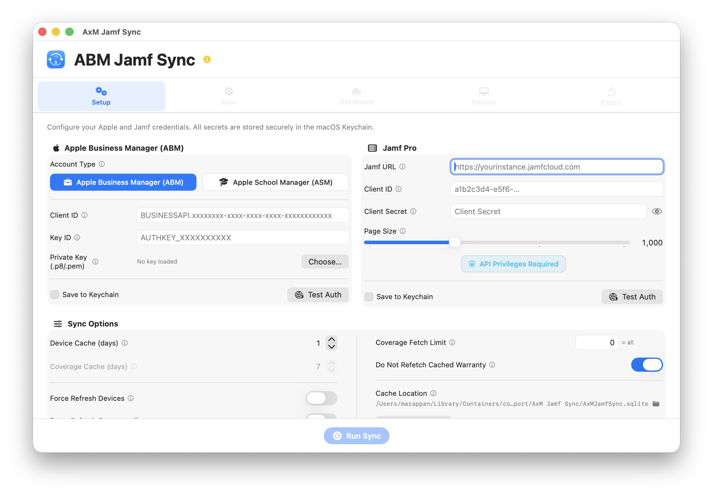
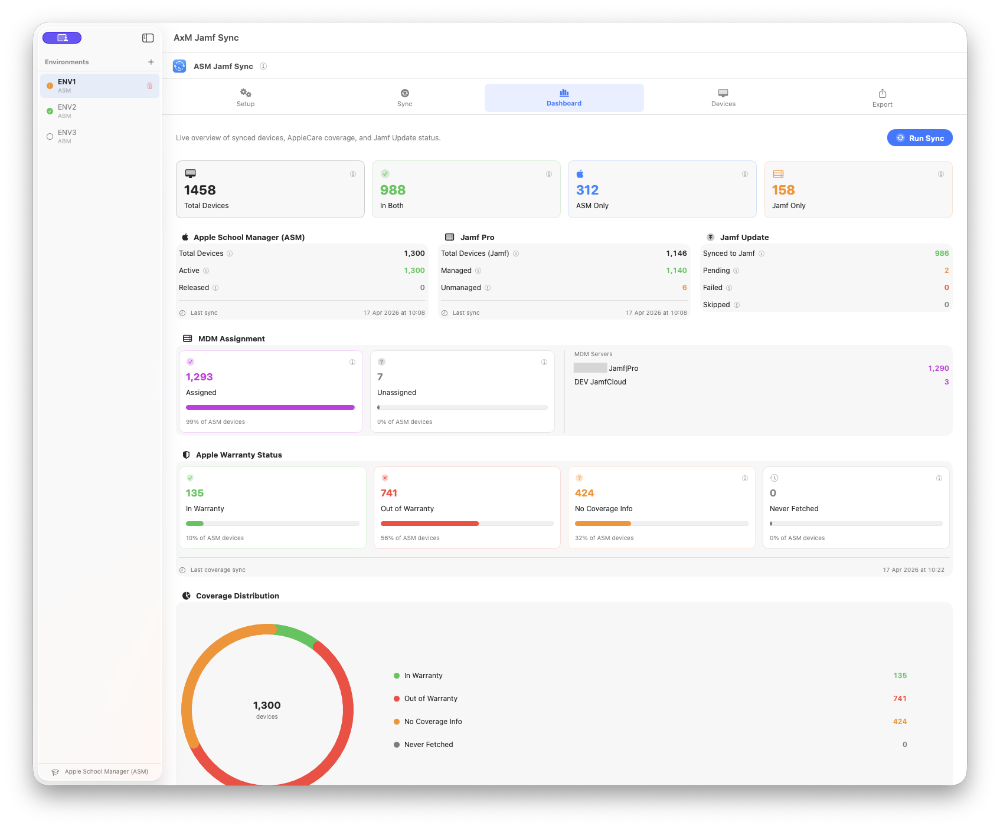
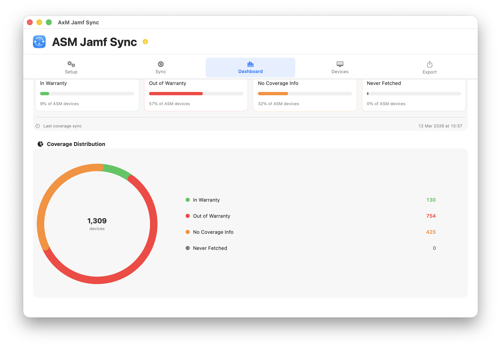
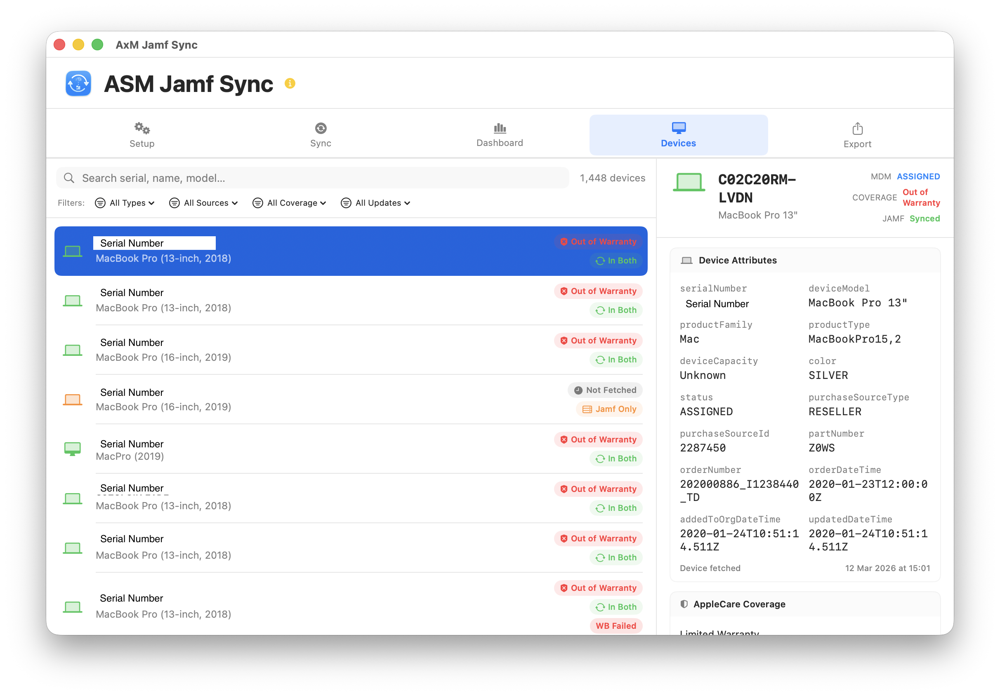
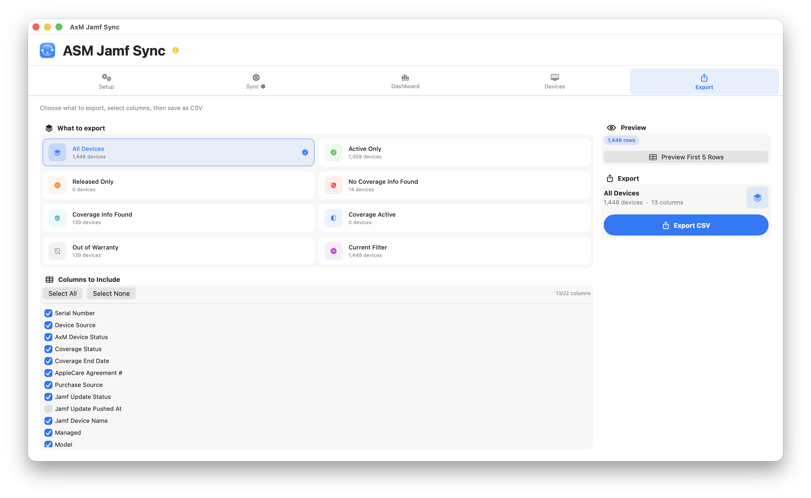

<div align="center">

      

# AxM Jamf Sync
<p align="center">
  <a href="#what-it-does">What it does</a> •
  <a href="#requirements">Requirements</a> •
  <a href="#installation">Installation</a> •
  <a href="#quick-start">Quick Start</a> •
  <a href="#tabs-overview">Tabs Overview</a> •
<a href="https://github.com/karthikeyan-mac/AxMJamfSync/wiki">Wiki</a> •   
  <a href="#license">License</a>
</p>

**Sync AppleCare warranty coverage from Apple Business Manager (ABM) or Apple School Manager (ASM) into Jamf Pro — in four steps, on one Mac.**

   [](https://www.apple.com/macos/)
   [](https://swift.org/)
   [](https://developer.apple.com/xcode/swiftui/)
   [](LICENSE)
   [](https://developer.apple.com/support/code-signing/)
   [](https://developer.apple.com/documentation/security/notarizing_macos_software_before_distribution)

</div>

---

## What it does

AxM Jamf Sync runs a four-step pipeline on demand:

| Step | What happens |
|------|--------------|
| **1 — AxM Devices** | Downloads every device record from your ABM or ASM organisation |
| **2 — Jamf Computers** | Downloads computers and mobile devices from your Jamf Pro instance |
| **3 — AppleCare Coverage** | Fetches warranty/AppleCare status for each device from Apple's coverage API |
| **4 — Jamf Update** | Writes the warranty end date, AppleCare agreement number, and vendor back to each matching Jamf record |

The result: every device record in Jamf Pro shows accurate, up-to-date warranty information pulled straight from Apple — no spreadsheets, no manual entry.

---

## Screenshots








---

## Requirements

- **macOS 14.0 (Sonoma)** or later
- **Apple Business Manager** or **Apple School Manager** account with API access
- **Jamf Pro** (cloud or on-prem) with an OAuth API client
- An Apple API private key (.pem file) generated in ABM/ASM

---

## Disclaimer

This app was developed with the help of AI agents. Please test it thoroughly before using it in a production environment.

If you encounter any bugs, notice issues, or have suggestions for improvements or new features, please submit them in the **Issues** section.

---

## Installation

### Option A — Download release (recommended)

1. Download the latest application `AxMJamfSync.dmg` from the [Releases](../../releases) page
2. Open the DMG and drag **AxM Jamf Sync** to your Applications folder
3. Launch the app — it is signed and notarized, so Gatekeeper will open it without warnings

### Option B — Build from source

```bash
git clone https://github.com/karthikeyan-mac/AxMJamfSync.git
cd AxMJamfSync
open AxMJamfSync.xcodeproj
```

Select your team in **Signing & Capabilities**, then build with **⌘B**.

---

## Quick Start

### 1 — Create an Apple API Key

1. Sign in to [Apple Business Manager](https://business.apple.com) or [Apple School Manager](https://school.apple.com)
2. Go to **Settings → API** and click **+** to create a new key
3. Download the `.pem` private key file — Apple only lets you download it once
4. Note the **Client ID** and **Key ID** shown on the API key detail page

### 2 — Create a Jamf Pro API Client

1. In Jamf Pro go to **Settings → API Roles and Clients**
2. Create an **API Role** with these four privileges:
   - Read Computers
   - Read Mobile Devices
   - Update Computers
   - Update Mobile Devices
3. Create an **API Client**, assign the role, and generate a **Client Secret**
4. Copy the **Client ID** and **Client Secret**

### 3 — Configure AxM Jamf Sync

1. Launch the app and go to the **Setup** tab
2. Under **Apple Manager**, select **ABM** or **ASM**, enter your Client ID and Key ID, then click **Choose…** to load your `.pem` key file
3. Tick **Save to Keychain** and click **Test Auth** — you should see a green tick
4. Under **Jamf Pro**, enter your server URL, Client ID, and Client Secret
5. Tick **Save to Keychain** and click **Test Auth**

### 4 — Run a sync

Go to the **Sync** tab and click **Run Sync**. Watch the four steps complete in the progress panel. When it finishes, open the **Dashboard** or **Devices** tab to review results.

---

## Documentation

Detailed guides and additional documentation are available in the [Project Wiki](https://github.com/karthikeyan-mac/AxMJamfSync/wiki).

---

## Tabs overview

| Tab | Purpose |
|-----|---------|
| **Setup** | Enter credentials, tune cache and coverage settings |
| **Sync** | Run, monitor, and stop syncs; view the live log |
| **Dashboard** | Summary tiles: device counts, coverage breakdown, ring chart, last-run stats |
| **Devices** | Searchable, filterable table of every device with source badge and coverage status |
| **Export** | CSV export with presets and configurable columns |

---

## Privacy & Security

- **No data leaves your Mac** except to Apple's ABM/ASM API and your own Jamf Pro server
- All credentials are stored in the **macOS Keychain** (`kSecAttrAccessibleWhenUnlockedThisDeviceOnly`) — never in plain text
- TLS certificate validation is enforced on every connection — self-signed and MITM proxy certificates are rejected
- JWT client assertions use ES256 with a 10-minute lifetime (Apple's recommended maximum)
- Log files are written to `~/Library/Logs/AxMJamfSync/` with `0600` permissions (owner read/write only)
- The app is fully **App Sandboxed** with the minimum required entitlements

---

## Sync behaviour

- **Caching**: By default the device list is cached for 1 day and coverage results for 7 days. A second sync run the same day skips re-downloading unless you enable Force Refresh.
- **Coverage fetch limit**: Set a limit (e.g. 500) to cap Apple API calls per run. The next run automatically resumes where the last one stopped.
- **Do Not Refetch Cached Warranty**: On by default — devices that already have a coverage result are skipped, saving time and reducing Apple API usage.
- **Partial stop**: If you click Stop Sync mid-run, any coverage already fetched in that run is saved. The next run resumes from where it left off.
- **Token reuse**: Apple tokens (1-hour TTL) are cached in Keychain and reused across runs to avoid rate limiting.

---

## Troubleshooting

| Problem | What to check |
|---------|---------------|
| **"Test Auth" fails for ABM/ASM** | Confirm Client ID, Key ID, and that the `.pem` file matches the key in ABM/ASM |
| **"Test Auth" fails for Jamf** | Check the server URL has no trailing slash; confirm the API client has not expired |
| **Coverage shows 0 fetched** | Check ABM/ASM has the correct device records; confirm the API key has not been revoked |
| **Jamf Update shows all Failed** | Confirm the API Role includes Update Computers / Update Mobile Devices |
| **"In Both" count is 0** | Run at least one full sync (Step 1 + Step 2) so devices can be merged by serial number |
| **App won't open (Gatekeeper)** | Right-click → Open on the first launch, or download the signed release build |

Full log output is available in **Sync → Log** and in `~/Library/Logs/AxMJamfSync/sync.log`.

---

## Building & contributing

Pull requests are welcome. Please open an issue before starting significant work.

```
AxMJamfSync/
├── Models.swift              — Data types, enums, Device struct
├── AppStore.swift            — @MainActor state, CoreData CRUD, filtering
├── AppPreferences.swift      — UserDefaults keys and AppPreferences object
├── PersistenceController.swift — CoreData stack (NSPersistentContainer)
├── KeychainService.swift     — Keychain CRUD for all credentials and tokens
├── ABMService.swift          — Apple ABM/ASM API actor (devices + coverage)
├── JamfService.swift         — Jamf Pro API actor (computers + mobile + PATCH)
├── SyncEngine.swift          — 4-step pipeline orchestration (@MainActor)
├── LogService.swift          — Log sink (UI entries + rotating file)
├── SyncNotificationService.swift — User Notification Centre integration
├── TLSDelegate.swift         — URLSessionDelegate for TLS validation
├── ContentView.swift         — Root TabView and navigation
├── SetupView.swift           — Credentials + settings UI
├── SyncPanelView.swift       — Sync progress panel and live log
├── DashboardView.swift       — Stats tiles and coverage ring chart
├── DevicesView.swift         — Device table with filtering
└── ExportView.swift          — CSV export with presets
```

---

## License

MIT — see [LICENSE](LICENSE)

---


## Acknowledgements

- **Apple** - [SwiftUI](https://developer.apple.com/xcode/swiftui/) framework
- **Jamf** - [Jamf Pro API](https://developer.jamf.com/) documentation
- **Mac Admins India community** - https://macadmins.in/
- **Jamf Nation Community** - Feedback and feature requests
- **macOS admins** - Testing and real-world usage
- **AI** - ([ChatGPT](https://chatgpt.com) & [Claude](https://claude.ai/))

---

**AxM Jamf Sync** is not affiliated with, endorsed by, or sponsored by Jamf Software LLC.
Jamf and Jamf Pro are trademarks of Jamf Software LLC.

---

<div align="center">
Developed by <a href="https://www.linkedin.com/in/bewithkarthi/">Karthikeyan Marappan</a>
</div>
