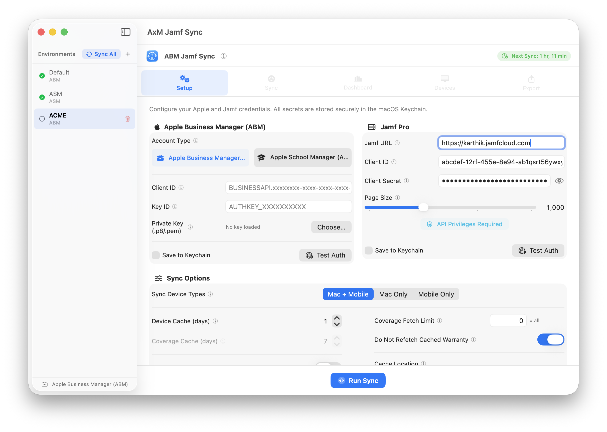
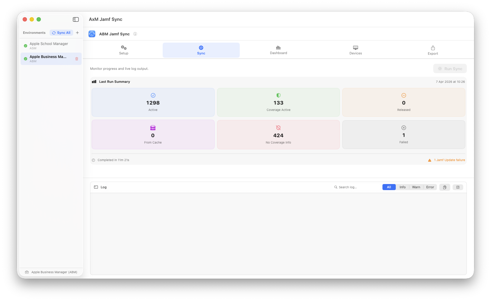
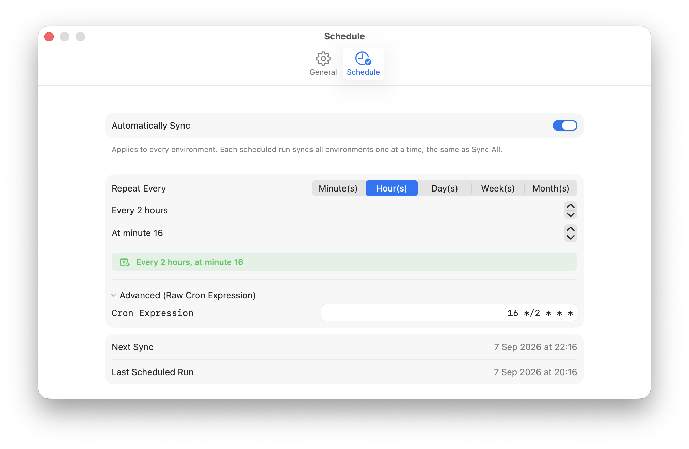
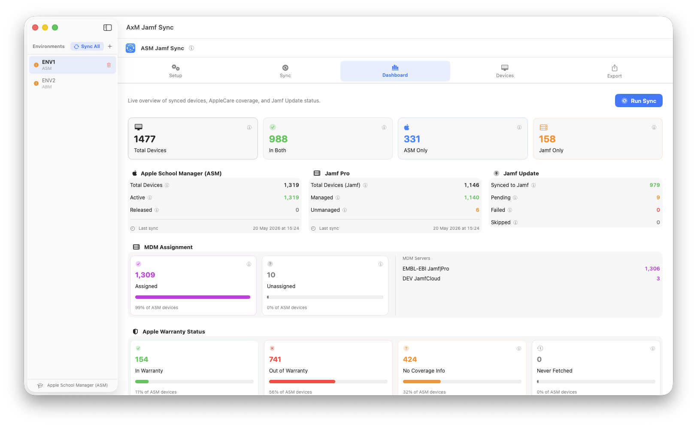
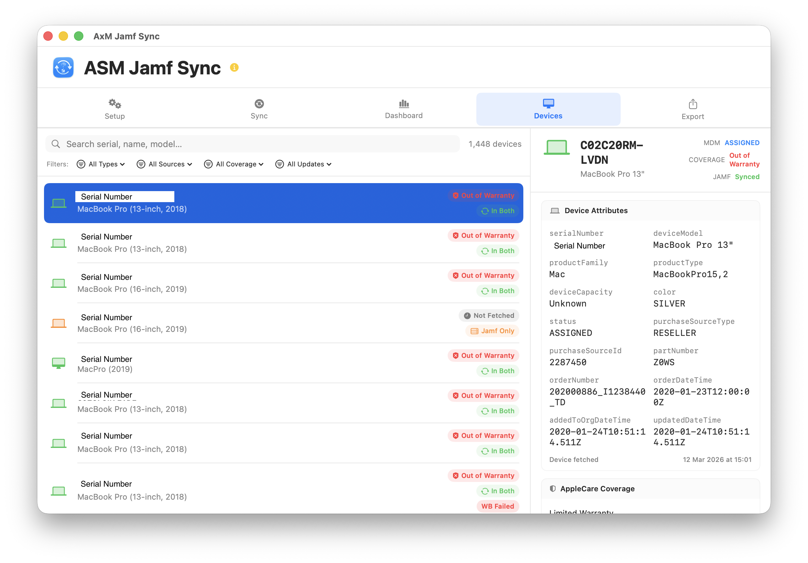
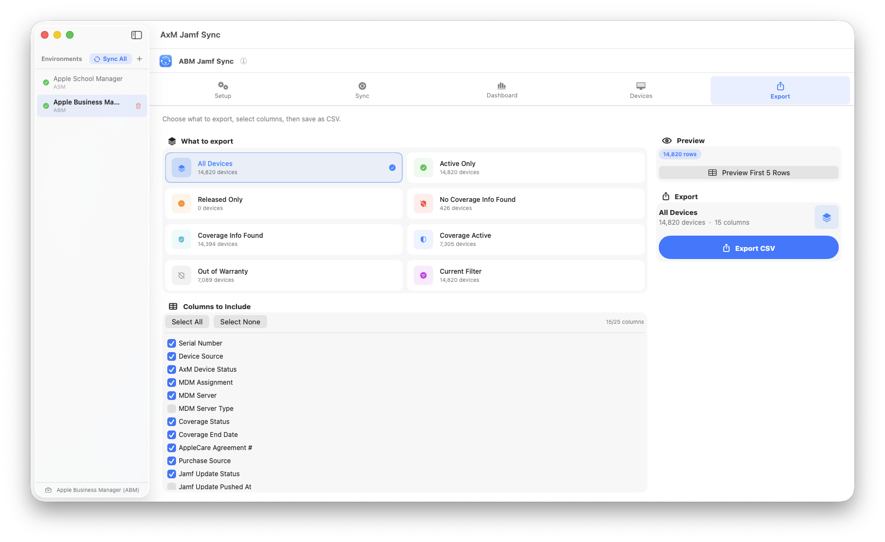

<div align="center">


# AxM Jamf Sync

<p align="center">
  <a href="#what-it-does">What it does</a> •
  <a href="#requirements">Requirements</a> •
  <a href="#installation">Installation</a> •
  <a href="#quick-start">Quick Start</a> •
  <a href="#tabs-overview">Tabs Overview</a> •
  <a href="https://github.com/karthikeyan-mac/AxMJamfSync/wiki">Wiki</a> •
  <a href="#license">License</a>
</p>

**Sync AppleCare warranty coverage from Apple Business Manager (ABM) or Apple School Manager (ASM) into Jamf Pro — across multiple environments, in four steps, on one Mac.**

[](https://www.apple.com/macos/)
[](https://swift.org/)
[](https://developer.apple.com/xcode/swiftui/)
[](LICENSE)
[](https://developer.apple.com/support/code-signing/)
[](https://developer.apple.com/documentation/security/notarizing_macos_software_before_distribution)

</div>

---

## What it does

AxM Jamf Sync runs a four-step pipeline on demand:

| Step | What happens |
|------|-------------|
| **1 — AxM Devices** | Downloads every device record from your ABM or ASM organisation |
| **2 — Jamf Inventory** | Downloads computers and mobile devices from Jamf Pro |
| **3 — AppleCare Coverage** | Fetches warranty and AppleCare status from Apple's coverage API |
| **4 — Jamf Update** | Writes warranty date, AppleCare agreement number, vendor, PO number, and PO date back to each matching Jamf record |

The result: every device record in Jamf Pro shows accurate, up-to-date warranty and purchasing information pulled straight from Apple — no spreadsheets, no manual entry.

---

## What's new

See the wiki's [Release Notes](https://github.com/karthikeyan-mac/AxMJamfSync/wiki/Release-Notes) for the full version history.

---

## Screenshots











---

## Requirements

- **macOS 14.0 (Sonoma)** or later
- **Apple Business Manager** or **Apple School Manager** with API access
- **Jamf Pro** (cloud or on-prem) with an OAuth API client
- An Apple API private key (`.pem` file) from ABM/ASM

---

## Disclaimer

This app was developed with the help of AI agents. Please test thoroughly before using in production. Submit bugs and feature requests in the **Issues** section.

---

## Installation

### Option A — Download release (recommended)

1. Download `AxMJamfSync.dmg` from the [Releases](../../releases) page
2. Open the DMG and drag **AxM Jamf Sync** to Applications
3. Launch — it is signed and notarized, Gatekeeper opens it without warnings

The app checks GitHub Releases for newer versions and shows an **Update Available** item in the menu bar (or **AxM Jamf Sync → Check for Updates…** on demand). Updating is manual: download the new DMG and replace the app.

### Option B — Build from source

```bash
git clone https://github.com/karthikeyan-mac/AxMJamfSync.git
cd AxMJamfSync
open AxMJamfSync.xcodeproj
```

Select your team in **Signing & Capabilities**, then build with **⌘B**.

---

## Quick Start

### 1 — Create an Apple API Key

1. Sign in to [business.apple.com](https://business.apple.com) or [school.apple.com](https://school.apple.com)
2. Go to **Settings → API** → click **+** to create a new key
3. Download the `.pem` file — Apple only lets you download it once
4. Note the **Client ID** and **Key ID**

### 2 — Create a Jamf Pro API Client

1. Go to **Settings → API Roles and Clients**
2. Create a **Role** with: Read Computers, Read Mobile Devices, Update Computers, Update Mobile Devices
3. Create a **Client**, assign the role, generate a **Client Secret**

### 3 — Configure AxM Jamf Sync

1. Launch the app — your setup opens in the sidebar as **Default**
2. In **Setup → Apple Manager**, enter your Client ID and Key ID, load your `.pem` file — it saves to the Keychain automatically as you type
3. Click **Test Auth** — green ✓
4. In **Setup → Jamf Pro**, enter URL, Client ID, and Client Secret — again, saved automatically
5. Click **Test Auth**

### 4 — Run a sync

Go to the **Sync** tab and click **Run Sync**.

### 5 — Sync multiple environments at once

Click **Sync All** in the sidebar header, select the environments you want, and click **Add to Queue**. Syncs run one at a time in order — browse freely while the queue runs.

### 6 — Add more environments

Click **+** in the sidebar, give it a name, and configure separate credentials in Setup. Each environment is fully isolated.

---

## Command-line / headless mode

The app binary can run a sync with no UI — for launchd, cron or scripts. It uses the same environments, credentials, device cache and preferences as the app, and the app picks up the results the next time you look at it. Run it bare from a terminal (no arguments) and it prints help instead of opening a window; pass `--gui` if you want the window.

```bash
"/Applications/AxM Jamf Sync.app/Contents/MacOS/AxM Jamf Sync" --silent            # all environments
"/Applications/AxM Jamf Sync.app/Contents/MacOS/AxM Jamf Sync" --silent --env "Prod"
"/Applications/AxM Jamf Sync.app/Contents/MacOS/AxM Jamf Sync" --help              # full usage
```

- **A full sync, same as Run Sync in the app** — including writing warranty/purchase data back to Jamf Pro. There's no separate read-only mode; `--silent` behaves exactly like a manual sync would.
- **No notifications, no window.** Results go to the log files, each line tagged `[GUI]` or `[CLI]` depending on which one wrote it — `sync.log` gets a one-line start/finish summary per run, and each environment's own log has the full step-by-step detail.
- Exit code: `0` success (or every environment skipped, e.g. because the app was already syncing it), `1` partial, `2` failed, `3` cancelled, `64` bad arguments, `78` no environment configured / `--env` matched none.
- Requires a logged-in user session — schedule it with a LaunchAgent, not a LaunchDaemon. A ready-to-edit sample agent is in [`docs/launchd/`](docs/launchd/).
- This is separate from the in-app **Settings → Schedule** — use one or the other, not both, or you'll get duplicate syncs. See the wiki's [Command-Line Mode](https://github.com/karthikeyan-mac/AxMJamfSync/wiki/Command-Line-Mode) page for the full reference.

---

## Documentation

Full guides: [Project Wiki](https://github.com/karthikeyan-mac/AxMJamfSync/wiki)

---

## Tabs overview

| Tab | Purpose |
|-----|---------|
| **Setup** | Credentials, cache settings, sync options |
| **Sync** | Run, monitor, and stop syncs; view the live log |
| **Dashboard** | Default / Apple / Jamf Pro focus modes — device counts, coverage breakdown, charts, drill-downs, last-run stats |
| **Devices** | Searchable, filterable table of every device |
| **Export** | CSV export with presets and configurable columns |

---

## Privacy & Security

- **No device or Jamf data leaves your Mac** except to Apple's ABM/ASM API and your own Jamf Pro server
- The only other connection is an optional once-a-day update check against the public GitHub Releases API (`api.github.com`). It sends no data from your Mac beyond a standard HTTPS request, never downloads or installs anything, and can be turned off in **Settings → General → Check for Updates Automatically**
- All credentials stored in the **macOS Keychain** (`kSecAttrAccessibleWhenUnlockedThisDeviceOnly`), namespaced per environment
- TLS certificate validation enforced on every connection
- JWT client assertions use ES256 with a 10-minute lifetime
- Log files written to `~/Library/Containers/com.karthikmac.axmjamfsync/Data/Library/Logs/AxMJamfSync/` with `0600` permissions
- Fully **App Sandboxed**

---

## Sync behaviour

- **Caching** — device list cached 1 day, coverage 7 days by default. Second run same day skips re-downloading unless Force Refresh is enabled
- **Sync Device Types** — choose Mac + Mobile (default), Mac Only, or Mobile Only
- **Coverage Fetch Limit** — cap Apple API calls per run; next run resumes exactly where the last stopped
- **Do Not Refetch** — skip devices already checked, reducing API calls significantly
- **Purchasing fields** — PO Number, PO Date, and Vendor (formatted as `"purchaseSourceType (purchaseSourceId)"`) are written to Jamf alongside warranty data
- **External change detection** — if warranty date, vendor, PO number, or PO date are edited in Jamf after a sync, the next run re-queues those devices automatically
- **Serial sync queue** — all syncs run serially; clicking Run Sync while another environment is syncing adds it to the queue rather than running in parallel
- **Scheduled syncs** — set a recurring cadence in Settings → Schedule; scheduled runs go through the same serial queue as Sync All, with start and completion notifications
---

## Troubleshooting

| Problem | What to check |
|---------|---------------|
| Test Auth fails for ABM/ASM | Confirm Client ID, Key ID, and `.pem` file match the key in ABM/ASM |
| Test Auth fails for Jamf | No trailing slash on URL; confirm API client hasn't expired |
| Coverage shows 0 fetched | Check ABM/ASM has the correct records; confirm API key not revoked |
| Jamf Update all Failed | Confirm API Role includes Update Computers / Update Mobile Devices |
| In Both count is 0 | Run a full sync (Step 1 + Step 2) so devices can be matched by serial |
| App won't open (Gatekeeper) | Right-click → Open on first launch, or download the signed release |

Full log: **Help → Open Sync Log in Console** or `~/Library/Containers/com.karthikmac.axmjamfsync/Data/Library/Logs/AxMJamfSync/`

---

## Project structure

```
AxMJamfSync/
├── Models.swift                  — Data types, enums, Device struct
├── AppStore.swift                — @MainActor state, CoreData CRUD, filtering
├── AppPreferences.swift          — UserDefaults (env-namespaced in v2)
├── PersistenceController.swift   — CoreData stack, per-environment SQLite
├── KeychainService.swift         — Keychain CRUD, env-namespaced credentials
├── ABMService.swift              — Apple ABM/ASM API (devices + coverage)
├── JamfService.swift             — Jamf Pro API (computers + mobile + PATCH)
├── SyncEngine.swift              — 4-step pipeline orchestration
├── LogService.swift              — Per-environment log (UI + rotating file)
├── EnvironmentStore.swift        — Multi-environment management + sync queue (v2)
├── ContentView.swift             — NavigationSplitView root
├── EnvironmentSidebarView.swift  — Environment sidebar + Sync All button (v2)
├── SetupView.swift               — Credentials + settings UI
├── SyncPanelView.swift           — Sync progress and live log
├── DashboardView.swift           — Default focus dashboard (v2.4: + facet bar)
├── AxMDashboardView.swift        — Apple-focused dashboard (v2.4)
├── JamfDashboardView.swift       — Jamf-focused dashboard (v2.4)
├── DashboardChartViews.swift     — Shared Swift Charts components (v2.4)
├── DevicesView.swift             — Device table with filtering + multi-select
├── ExportView.swift              — CSV export with presets
├── SyncScheduler.swift           — Automatic scheduling engine (cron-based, v2.3)
├── CronExpression.swift          — 5-field POSIX cron parsing + next-fire-date (v2.3)
├── FriendlyCronBuilderView.swift — Plain-language schedule builder UI (v2.3)
├── AppRunModeController.swift    — Dock vs. menu-bar-only toggle (v2.3)
├── SyncOutcome.swift             — Four-state sync outcome (v2.4)
├── DiagnosticsExporter.swift     — Help → Export Diagnostics… bundle (v2.4)
├── HeadlessMode.swift            — `--silent` command-line mode, entry point (v3.0)
└── UpdateChecker.swift           — GitHub Releases update notifier (notify-and-link, v3.0)
```
---

## Found this useful?

If this project, script, or anything I’ve shared has saved you some time or made your day a little easier, you can buy me a coffee⁠. ☕️

[](https://ko-fi.com/karthikeyanmac)

---
---

## License

MIT — see [LICENSE](LICENSE)

---

## Acknowledgements

- **Apple** — [SwiftUI](https://developer.apple.com/xcode/swiftui/) framework
- **Jamf** — [Jamf Pro API](https://developer.jamf.com/) documentation
- **Mac Admins India** — https://macadmins.in/
- **Jamf Nation Community** — Feedback and feature requests
- **AI** — [ChatGPT](https://chatgpt.com) & [Claude](https://claude.ai/)

---

**AxM Jamf Sync** is not affiliated with, endorsed by, or sponsored by Jamf Software LLC. Jamf and Jamf Pro are trademarks of Jamf Software LLC.

<div align="center">
Developed by <a href="https://www.linkedin.com/in/bewithkarthi/">Karthikeyan Marappan</a>
</div>
